# 
<h1 align="center">My Resume</h1>

My resume is a custom site built to present my skills, completed projects, education and previous work experience to potential employers and clients.

This site was built using [GitHub Pages](https://pages.github.com/).

[View my site](https://lucyjpjones.github.io/LucyJones-resume/)

---

## <u>Table of contents</u>

  - [&rarr; **User Experience (UX)**](#-rarr----user-experience--ux---)
    + [Purpose](#purpose)
    + [User stories](#user-stories)
    + [Design](#design)
    + [Wireframes](#wireframes)
- [&rarr; **Features**](#-rarr----features--)
    + [Features used](#features-used)
    + [To-do list](#to-do-list)
    + [Status](#status)
- [&rarr; **Technologies**](#-rarr----technologies--)
    + [Languages](#languages)
    + [Frameworks, Libraries & Programs](#frameworks--libraries---programs)
- [&rarr; **Deployment**](#-rarr----deployment--)
    + [Deploy to Github](#deploy-to-github)
    + [Accessing code](#accessing-code)
- [&rarr; **Testing**](#-rarr----testing--)
    + [Testing user stories](#testing-user-stories)
    + [Validator checks](#validator-checks)
    + [Responsive Design](#responsive-design)
    + [Additional Testing](#additional-testing)
    + [Bugs](#bugs)
- [&rarr; **Credits**](#-rarr----credits--)
    + [Content](#content)
    + [Media](#media)
    + [Acknowledgements](#acknowledgements)
- [&rarr; **Contact**](#-rarr----contact--)

---

## &rarr; **User Experience (UX)**

#### Purpose

The purpose of this project is to create an online presence for myself whilst developing my experience using HTML and CSS frameworks. My main goal is to get myself noticed and increase my chances of getting hired.

The online resume will aim to give users proof of my ability and confidence in what I can do. 

#### User stories

The <u>key priorities</u> for my user are as follows:

1. To be able to easily navigate throughout the site to find the desired content.

2. Ability to access a hard copy of my CV.

3. To view my portfolio of work.

4. Ability to contact me.

5. View my current skills and experience.

6. Access links to my external social accounts.

#### Design

>**It takes about 50 milliseconds for users to form an opinion about your website that determines whether they’ll stay or leave** - Peep Laja, 2020

- **Structure**
  - A simple design structure with header pattern repeated to make it easy for my users to navigate around the site.

- **Colour scheme**
  - A monochromatic colour scheme to keep the design looking clean and elegant.
  - Key colour is purple which is most frequently associated with creativity and imagination.
  - A white background used throughout the site to avoid any visual obstacles and helping add visual emphasis to other important parts of the design. I decided to use an off-white (#fafafa) as it is easier on the eyes.

- **Typography**
  - The Montserrat font is the main font used throughout the whole website with Sans Serif as the fallback font if for any reason the font isn't being imported into the site correctly. Montserrat is a clean font used frequently in programming, so it is both attractive and appropriate.

#### Wireframes

As part of the design process, before starting my project I used <u>Balsamiq</u> to create wireframes. Creating these mock-ups helped me plan the basic structure and arrangement of the features for my site.

[View PDF of wireframes](assets/pdf/wireframes.pdf)

---
## &rarr; **Features**

#### Features used:

- **Responsive on all device sizes**
  - Responsive through using Bootstrap grid system and CSS media queries.

- **Nav links**
  - A navigation menu to allow the user to easily access different pages of the site. There is also a nav marker icon featured on the map image that allows the user to link back to the homepage from every page.

- **Download link**
  - A PDF download link to allow the user to access a hard copy of my CV. The file opens in a new tab to ensure websites presence is still maintained.

- **Carousel**
  - A carousel Bootstrap component used to showcase my projects.

- **Form**
  - A contact form with submit button for users to easily get in touch via my website.
  - The form has been set up to ensure all fields are filled out and that the email is written in the correct format.
- **Timelines**
  - Education and work history presented in a timeline to provide a clear summary of my experience.

- **Progress bars**
  - Progress bars used to visually represent my personal skills.

- **External links to social platforms**
  - Recognisable icons with links to my external social platforms.

#### To-do list:

- **Carousel multi items**
  - Make multiple slides visible on medium or larger devices (This layout is shown in my wireframes).

- **Contact form**
   - I will add to my HTML code to create a working form with the use of method and action attributes.
   - I will add a model response for the user when I have a greater knowledge of the Javascript language.

#### Status

> Project is: <u>ongoing</u>

I will update my project as I learn new software skills and embark on new ideas. My personal details will also be continuously updated to ensure I've included the latest information.

---
## &rarr; **Technologies**

#### Languages
- [HTML5](https://en.wikipedia.org/wiki/HTML5)
- [CSS3](https://en.wikipedia.org/wiki/Cascading_Style_Sheets)

#### Frameworks, Libraries & Programs

- [**Bootstrap 4.5.0**](https://getbootstrap.com/)
    - Bootstrap was used to assist with the responsiveness and styling of the website using design templates.

- [**Google fonts**](https://fonts.google.com/)
  - Google fonts were used to import the 'Montserrat' font into the style.css file which is used on all pages throughout the project.
- [**Font Awesome 4.7.0**](https://fontawesome.com/)
  - Font Awesome was used on all pages throughout the website to add icons for aesthetic and UX purposes.

- [**jQuery:**](https://jquery.com/)
  - jQuery came with Bootstrap to make the components used responsive.
  - Included at end of body tag within HTML files to ensure smooth running off HMTL and CSS.

- [**Git**](https://git-scm.com/)
  - Git was used for version control by utilizing the Gitpod terminal to commit to Git and Push to GitHub.

- [**GitHub**](https://github.com/)
  - GitHub is used to store the project code after being pushed from Git.
  - GitHub Wiki TOC generator used to format README.md table of contents.

- [**Paint 3D:**](https://www.microsoft.com/en-gb/p/paint-3d/9nblggh5fv99?activetab=pivot:overviewtab)
  - Paint 3D was used to edit and create images for the website.

- [**Snipping Tool:**](https://support.microsoft.com/en-gb/help/13776/windows-10-use-snipping-tool-to-capture-screenshots)
  - Snipping Tool was used for screenshots of my website.

- [**Balsamiq**](https://balsamiq.com/)
  - Balsamiq was used to create the wireframes during the design process.

- [**Grammarly**](https://www.grammarly.com/)
  - Grammarly was used to ensure any grammar errors are eliminated.

- [**HTML Formatter**](https://www.freeformatter.com/html-formatter.html) and [**CSS Formatter**](https://www.freeformatter.com/css-beautifier.html)
  - Used to format my HTML and CSS file with desired indentation level for optimal readability.

- [**Tables generator**](https://www.tablesgenerator.com/)
  - Used to format table for bugs in README file.

- [**Lighthouse**](https://web.dev/measure/?gclid=Cj0KCQjwgo_5BRDuARIsADDEntTbdar9AKbypFb3lEsXY3jzIfnwdjJpcqxGon--H32hKNb1Obh5dccaAkLVEALw_wcB)
  - Used to check how well my website performs and get tips on improving my user's experience.
  
---

## &rarr; **Deployment**

#### Deploy to Github

The project was deployed to GitHub Pages using the following steps...

1. Log in to GitHub and locate the GitHub Repository. 

2. At the top of the Repository (not top of page), locate the "Settings" button on the menu. 

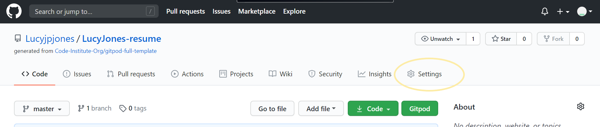

3. Scroll down the Settings page until you locate the "GitHub Pages" Section.

4. Under "Source", click the dropdown called "None" and select "Master Branch".

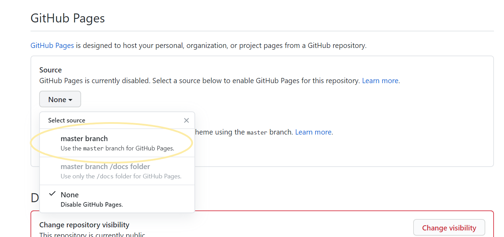

5. The page will automatically refresh.

6. Scroll back down through the page to locate the now published site link in the "GitHub Pages" section.

#### Accessing code


  Follow the steps below if you are wanting to propose changes to the project or to use the project as a starting point for your own idea.


- **Forking the GitHub Repository**

  Forking allows you to create a copy of the original repository and propose changes to the repository owner via a pull request. 

    1. Log in to GitHub and locate the GitHub Repository
    
    2. At the top of the Repository (not top of page) just above the "Settings" button on the menu, locate the "Fork" button.

    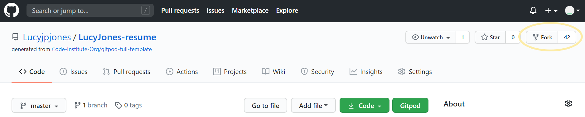
    
    3. You should now have a copy of the original repository in your GitHub account.

- **Making a Local Clone**

When you clone a repository, the repository is copied on to your local machine.

  1. Log in to GitHub and locate the GitHub Repository.

  2. Under the repository name, click the "download code" option.

  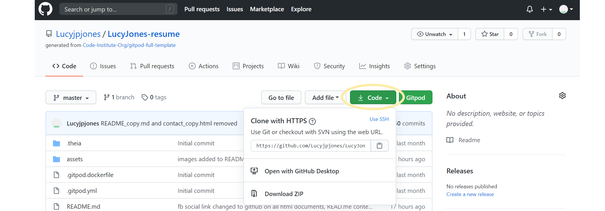

  3. To clone the repository using HTTPS, under "Clone with HTTPS", copy the link.

  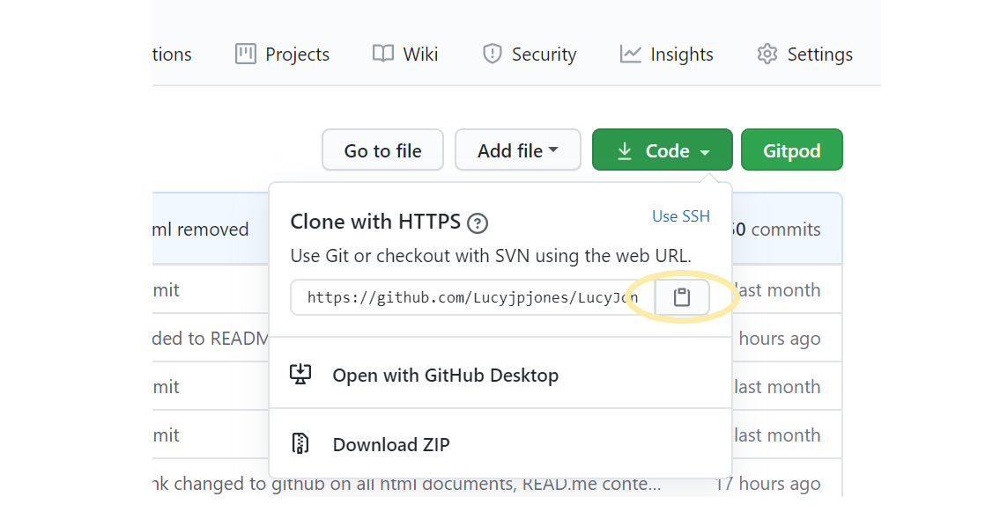

  4. Open Git Bash

  5. Change the current working directory to the location where you want the cloned directory to be made.

  6. Type git clone, and then paste the URL you copied in Step 3. 
  ```
  $ git clone https://github.com/YOUR-USERNAME/LucyJones-resume.git
  ```

  7.	Press Enter. Your local clone will be created.
    
  ```
  $ git clone https://github.com/YOUR-USERNAME/LucyJones-resume.git

  > Cloning into `LucyJones-resume`...
  > remote: Enumerating objects: 299, done.
  > remote: Counting objects: 100%, (299/299),  done.
  > remote: Compressing objects: 100% (156/156), done.
  > Recieving objects: remove: Total 299 (delta 145), reused 267 (delta 126), pack-reused 0
  > Recieving objects: 100% (299/299), 4.61MiB | 2.98 MiB/s, done.
  > Resolving deltas: 100% (145/145), done. Unpacking objects: 100% (10/10), done.
  ```

Now, you have a local copy of your fork of the LucyJones-resume repository.

> Note: The repository name and output numbers that you see on your computer, representing the total file size, etc, may differ from the example I have provided above.


---

## &rarr; **Testing**

#### Testing user stories
 Testing my user's <u>key priorities</u>:

1. **To be able to easily navigate throughout the site to find the desired content**
- Upon entering the site, users are automatically greeted with a simple structured homepage which is the header throughout all pages of the site.
-  The header features an easily readable navigation bar to go to the page of their choice.

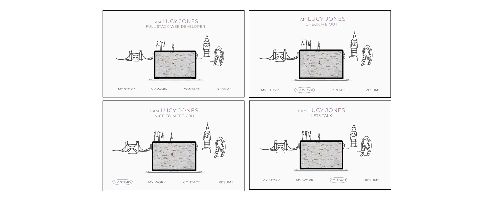
- Footer content is consistent throughout all pages.


2. **Ability to access a hard copy of my CV**
- 'Resume' link on the menu bar which is a direct link to download a hard copy of my CV.
- Visible on every page of the website.
- Opens up my CV in a new tab in the browser so the user won't lose their place on the site.

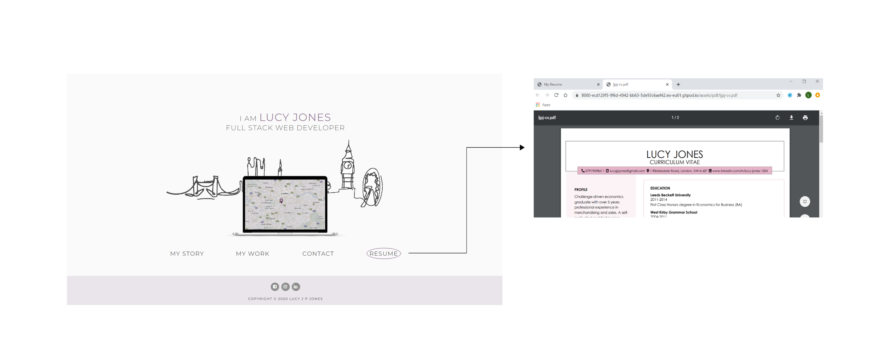

3. **To view my portfolio of work**
- 'My work' link on the menu bar to access the page with my latest projects.
- Carousel used to display projects and create user interaction with carousel indicators and control arrows.
- Overlay text to provide project summary.
- Button link to give user option to view the full project in another browser. 
  - Projects 1-3 are linked to mini-projects created during the course walkthroughs, but project 4-5 are just dummy images linking to my GitHub account.

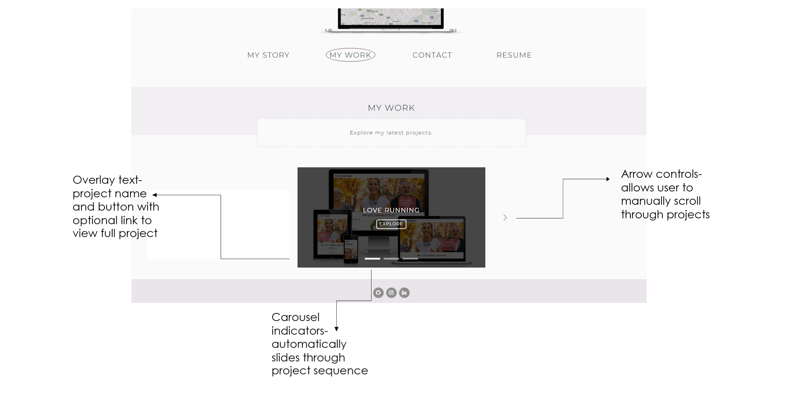

4. **Ability to contact me**
- 'Contact me' link on the menu bar to page with direct contact form.

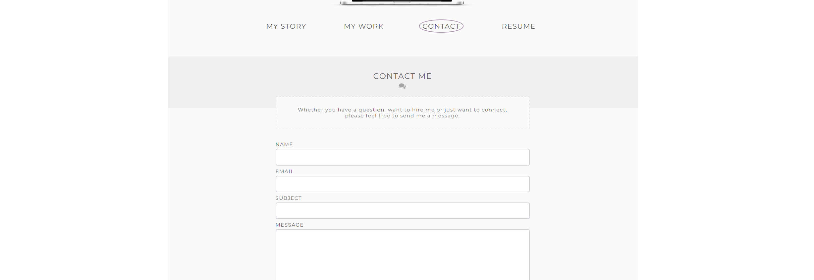

- Hover over map marker (homepage navigation link) to view my address.

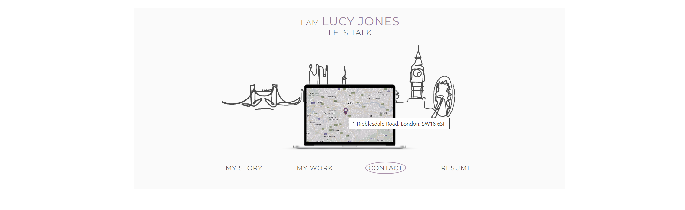

- Phone number and email included on 'My story' page.


- Contact details also accessible on the hard copy of cv.

5. **View my current skills and experience**
- 'My story' link on the menu bar to access a page with my current skills and experience.

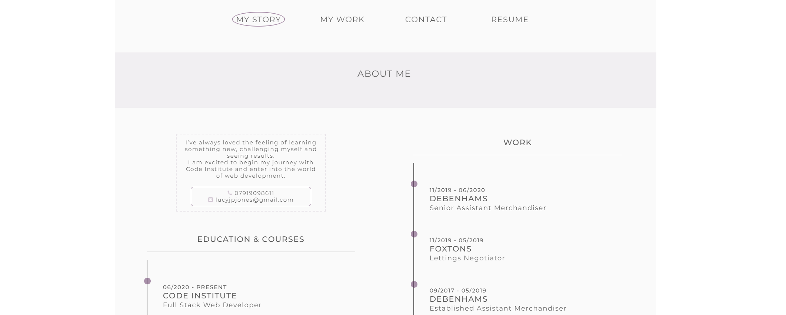

- This can also be found on the hard copy of CV.

6. **Access links to my external social accounts**
- At the bottom of each page, there is a footer which contains links to my social platforms which is consistent throughout all pages.
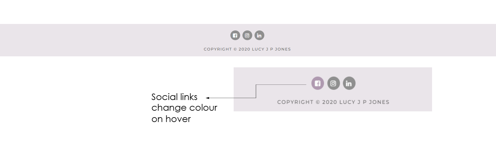

#### Validator checks

The W3C Markup Validator and W3C CSS Validator Services were used to validate every page of the project to ensure there were no syntax errors in the project. Code was entered through direct input.

- [**HTML Validator**](https://validator.w3.org/nu/#textarea)

  One warning message received;

> Warning: The document is not mappable to XML 1.0 due to two consecutive hyphens in a comment.
    
Code not altered as hyphens have been used to help structure my HTML code. Six hyphens used for headings with two for sub-headings.

- [**CSS Validator**](https://jigsaw.w3.org/css-validator/#validate_by_input)

  No error or warning messages received.

#### Responsive Design

- Site created as a mobile-first design inline with Bootstrap.

- Viewport tag included in the head of HTML files to tell the browser how to respond to different resolutions, particularly mobile ones.

- Media queries used in the CSS file to target larger devices.

#### Additional Testing

- The Website was tested on Google Chrome, Internet Explorer and Safari browsers.

- The website was viewed on a variety of devices including Laptop, Macbook, Ipad and IPhones (Version 6,8).

- Friends and family members were asked to review the site to point out any bugs, user experience issues and/or suggestions.
  - Feedback action:
    - Titles added to software skill icons so the user has a quick summary of the meaning of each language/program.
    - On the footer, Facebook link changed to Github as this is more favoured by my target audience.
    - Email address on 'My story' page added as a link so users can easily send a direct email.
- Project posted on Slack, asking for feedback from fellow students.

#### Bugs

| | Bug                                                  | Action                                           |
|-----------|------------------------------------------------------|--------------------------------------------------|
| [x]       | HTML logo not loading on safari or internet explorer | Change icon so it is compatible on all programs  |
| [ ]       | Sizing too small on IMac desktop                     | Create a new media query for screens over 1600px |
| [ ]       | Main image is slow to load                    | Changed format from PNG to WEBP to provide a faster download as advised by [Lighthouse](https://web.dev/measure/?gclid=Cj0KCQjwgo_5BRDuARIsADDEntTbdar9AKbypFb3lEsXY3jzIfnwdjJpcqxGon--H32hKNb1Obh5dccaAkLVEALw_wcB) but had to revert as the images didn't load on apple devices |


## &rarr; **Credits**
#### Content

- Bootstrap 4.5: Bootstrap Library used throughout the project, components used include the grid System, carousel, timeline and form templates.

- Software skills title text content taken from [Code Institute's](https://codeinstitute.net/) 'Full Stack Development Prospectus' and [Wikipedia](https://en.wikipedia.org/wiki/Wik).

- [W3schools.com](https://www.w3schools.com/): Helped with the code for overlaying text on an image and making my email address into a link.

#### Media
- The Macbook mockup image was created through [mockupphone.com](https://mockuphone.com/about).

- Inspiration for the London skyline image was taken from [Shutterstock](https://www.shutterstock.com/).

- Software icon images were taken from [pixabay](https://pixabay.com/), [Needpix](https://www.needpix.com/) and [Wikimedia commons](https://commons.wikimedia.org/wiki/Main_Page).

- The mockup image showing all devices on my README.md was created using [About Am I Responsive](http://ami.responsivedesign.is/)

#### Acknowledgements
 - My Mentor for continuous help and support throughout the project.

 - The [Code Institute](https://codeinstitute.net/) Slack Community.

## &rarr; **Contact**
Created by @lucyjpjones

If you have any problems, questions or suggestions for my project please contact me on the email below:

```
lucyjpjones@gmail.com
```

Thanks for visiting.

&copy;
LucyJPJones 

