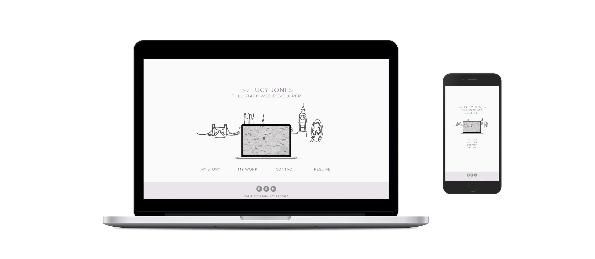

# 

# My Resume

[View the live project here.](https://codeinstitute.net)

My resume is a custom site built to present my skills, completed projects, education and previous work experience to potential employers and clients.

```
This site was built using [GitHub Pages](https://pages.github.com/).
```

---

## <u>Table of contents</u>
* [User Experience (UX)](#ux)
  * Purpose of site
  * User stories
  * Design
  * Wireframes

* [Features](#features)
  * Features used
  * To-do
  * Status

* [Technologies](#technologies)
  * Languages
  * Frameworks, Libraries & Programs

* [Testing](#testing)
  * Testing user stories
  * Validator checks
    * HTML
    * CSS
  * Responsive design
  * Additional Testing
  * Bugs

* [Deployment](#deployment)
  * Deploy to Github
  * Accessing code

* [Credits](#credits)
    * Content
    * Media
    * Acknowledgements

* [Contact](#contact)

---

## &rarr; User Experience (UX)

#### Purpose

The purpose of this project is to create an online presence for myself whilst developing my experience using HTML and CSS frameworks. My main goal is to get myself noticed and increase my chances of getting hired.

The online resume will aim to give users proof of my ability and confidence in what I can do. 

#### User stories

The <u>key priorities</u> for my user are as follows:

1. To be able to easily navigate throughout the site to find desired content
2. Ability to access a hard copy of my CV
2. To view my portfolio of work
3. Ability to contact me
5. View my current skills & experience
6. Access links to my other external social accounts

#### Design

>**It takes about 50 milliseconds for users to form an opinion about your website that determines whether they’ll stay or leave** - Peep Laja, 2020

* **Structure**
  * A simple design structure with repeated pattern to make it easy for my users to navigate around the site.

* **Color scheme**
  * Monochromatic colour scheme to keep the design looking clean and elegant.
  * Key colour is purple which is most frequently associated with creativity and imagination.

* **Typography**
  * The Montserrat font is the main font used throughout the whole website with Sans Serif as the fallback font in case for any reason the font isn't being imported into the site correctly. Montserrat is a clean font used frequently in programming, so it is both attractive and appropriate.


#### Wireframes

As part of the design process, before starting my project I used <u>Balsamiq</u> to create wireframes. Creating these mock-ups helped me plan the basic structure and arrangement of the features for my site.

[View PDF of wireframes]("assets/pdf/wireframes.pdf")

---
## &rarr; Features

#### Features used

* **Responsive on all device sizes**
  - Responsive through using bootstrap grid system and css media queries.
* **Nav links**
  - Navigation menu to allow user to easily access different pages of site. Also a nav icon link feautures on header map to allow user to easily go back to homepage from every page.
* **Form**
  - A contact form with submit button for users to easily get in touch via my website.
* **Timelines**
  - Education and work history presented in a timeline to provide a clear summary of my experience.
* **Download link**
  - A PDF download link to allow the user to access a hard copy of my CV. File opens in a new tab to ensure website's presence is still maintained.
* **External links to social platforms**
  - Recognisable icons with links to my external social platforms.
* **Progress bars**
  - Progress bars used to visually represent my personal skills.

#### To-do list:

- **Carousel multi items**
  - Make multiple slides visible on medium or larger devices

- **Model**
   - I will add model response to contact form when I have greater knowledge of Javascript language

- **Replace titles**
  - Replace title tags with a nicer formatted pop up text box.

#### Status

> Project is: <u>ongoing</u>

I will update my project as I learn new software skills and embark on new ideas. My personal details will also be continuously updated to ensure i've included the latest information.

---
## &rarr; Technologies

#### Languages
- [HTML5](https://en.wikipedia.org/wiki/HTML5)
- [CSS3](https://en.wikipedia.org/wiki/Cascading_Style_Sheets)

#### Frameworks, Libraries & Programs
- [**Bootstrap 4.5.0**](https://getbootstrap.com/)
    - Bootstrap was used to assist with the responsiveness and styling of the website using design templates.
- [**Google fonts**](https://fonts.google.com/)
  - Google fonts were used to import the 'Montserrat' font into the style.css file which is used on all pages throughout the project.
- [**Font Awesome 4.7.0**](https://fontawesome.com/)
  - Font Awesome was used on all pages throughout the website to add icons for aesthetic and UX purposes.
- [**Hover.css 2.1.1:**](https://ianlunn.github.io/Hover/)
    * Hover.css was used on the Social Media icons in the footer to add the float transition while being hovered over.
- [**jQuery:**](https://jquery.com/)
  - jQuery came with Bootstrap to make the navbar responsive but was also used for the smooth scroll function in JavaScript.
  - Included at end of body tag within HTML files to ensure smooth running off HMTL and CSS.
- [**Git**](https://git-scm.com/)
  - Git was used for version control by utilizing the Gitpod terminal to commit to Git and Push to GitHub.
- [**GitHub**](https://github.com/)
  - GitHub is used to store the projects code after being pushed from Git.
- [**Paint 3D:**](https://www.microsoft.com/en-gb/p/paint-3d/9nblggh5fv99?activetab=pivot:overviewtab)
  - Paint 3D was used to edit and create images for the website.
- [**Snipping Tool:**](https://support.microsoft.com/en-gb/help/13776/windows-10-use-snipping-tool-to-capture-screenshots)
  - Snipping Tool was used to take screenshots of my website for the markdown.
- [**Balsamiq**](https://balsamiq.com/)
  - Balsamiq was used to create the wireframes during the design process.

---

## &rarr; Deployment

#### Deploy to Github

The project was deployed to GitHub Pages using the following steps...

1. Log in to GitHub and locate the GitHub Repository. 
2. At the top of the Repository (not top of page), locate the "Settings" Button on the menu. Alternatively Click Here for a GIF demonstrating the process starting from Step 
3. Scroll down the Settings page until you locate the "GitHub Pages" Section.
4. Under "Source", click the dropdown called "None" and select "Master Branch".
5. The page will automatically refresh.
6. Scroll back down through the page to locate the now published site link in the "GitHub Pages" section.

#### Accessing code

---

## &rarr; Testing

#### Testing user stories
 Testing my users <u>key priorities</u>:

1. **To be able to easily navigate throughout the site to find the desired content**
- Upon entering the site, users are automatically greeted with a simple structured homepage which is the header throughout all pages of the site.
-  The header features an easily readable navigation bar to go to the page of their choice.


- Footer content is consistent throughout all pages.


2. **Ability to access a hard copy of my CV**
- 'Resume' link on menu bar which is a direct link to download a hard copy of my CV.
- Visible on every page of website
- Opens up CV in new tab in browser so user won't lose their place on the site.


3. **To view my portfolio of work**
- 'My work' link on menu bar to access page with my latest projects.
- Carousel used to display projects and create user interaction with carousel indicators and control arrows.
- Overlay text to provide project summary.
- Button link to give user option to view full project in browser.


4. **Ability to contact me**
- 'Contact me' link on menu bar to page with direct contact form.


- Hover over map marker (homepage navigation link) to view my address.


- Phone number and email included on 'My story' page.


- Contact details also accessible on hard copy of cv.

5. **View my current skills & experience**
- 'My story' link on menu bar to access a page with my current skills and experience.


- This can also be found on hard copy of CV.
6. **Access links to my other external social accounts**
- At the bottom of every page there is a footer which contains links to my social platforms which is consistent throughout all pages.


#### Validator checks

The W3C Markup Validator and W3C CSS Validator Services were used to validate every page of the project to ensure there were no syntax errors in the project. Code was entered through direct input.

* [**HTML Validator**](https://validator.w3.org/nu/#textarea)


- One warning message received;

> Warning: The document is not mappable to XML 1.0 due to two consecutive hyphens in a comment.
    
Code not altered as hyphens have been used to help structure my html code. Six hyphens used for headings with two for sub-headings.

* [**CSS Validator**](https://jigsaw.w3.org/css-validator/#validate_by_input)

  Warning messages received;

> Warning: 
      <br>
      -moz-transition, is an unknown vendor extension
      <br>
	  -webkit-transition is an unknown vendor extension
      <br>
      -o-transition is an unknown vendor extension
      <br>
      -ms-transform is an unknown vendor extension
      >
    
Code not altered as hyphens have been used to help support browser compatibility.

#### Responsive Design

- Site created as mobile first design inline with bootstrap.

- Viewport tag included in head of page to tell the browser how to respond to different resolutions, particularly mobile ones.

- Media queries used in css file to target larger devices.

#### Additional Testing
* The Website was tested on Google Chrome, Internet Explorer and Safari browsers.
* The website was viewed on a variety of devices including Laptop, Macbook, ipad and iPhone8.
* A large amount of testing was done to ensure that all pages were linking correctly.
* Friends and family members were asked to review the site to point out any bugs, user experience issues and/or suggestions.

#### Bugs & Feedback improvements
* Titles added to software skill icons so user has a quick summary of the meaning of each language/program.

## &rarr; **Credits**
#### Content

- Bootstrap 4.7: Bootstrap Library used throughout the project, coponents used include the grid System, carousel, timeline and form templates.

- Code Institue: Definitions for Software skills taken from code institute 'Full Stack Development Prospectus'.
#### Media
- The macbook mockup image was created through [mockupphone.com](https://mockuphone.com/about)

- Inspiration for skyline image was taken from [Shutterstock](https://www.shutterstock.com/)

#### Acknowledgements
 - My Mentor for continuous help and support throughout the project.

## &rarr; **Contact**
Created by @lucyjpjones

If you have any problems, questions or suggestions for my project please contact me on the email below:

```
lucyjpjones@gmail.com
```

Thanks for visiting.

&copy;
LucyJPJones 

