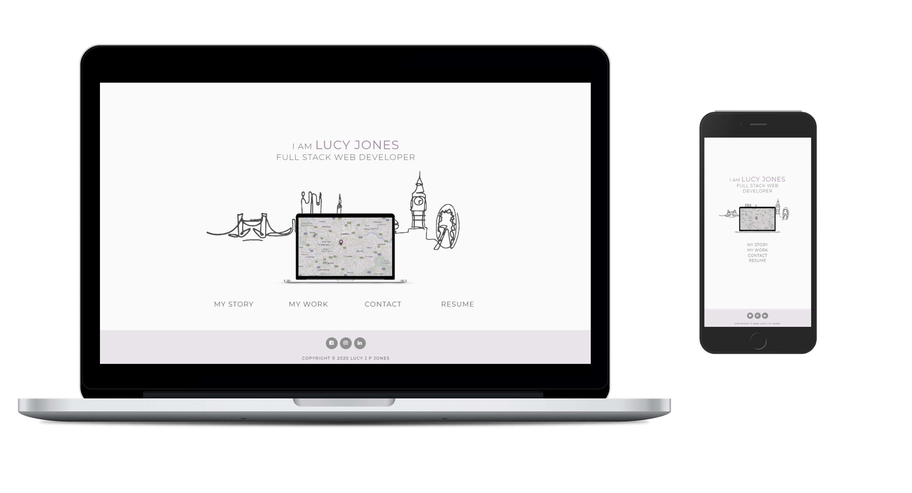

# 

# My Resume
My resume is a custom site built to present my skills, completed projects, education and previous work experience to potential employers and clients.

```
This site was built using [GitHub Pages](https://pages.github.com/).
```
---

## <u>Table of contents</u>
* [General info](#general-info)
  * Purpose of site
  * UX- visuals
  * Link to demo
* [Screenshots](#screenshots)
  * User journey
* [Technologies](#technologies)
* [Setup](#setup)
  * Deploy to Github
  * Accessing code
  * Code Examples
* [Features](#features)
  * Features used
  * To-do
  * Status
* [Testing](#testing)
  * Validator
    * HTML
    * CSS
  * General functioning of site and user journey
* [Credits](#credits)
    * Content
    * Media
* [Contact](#contact)

---

## &rarr; General info

The purpose of this project is to create an online presence for myself whilst developing my experience using HTML and CSS frameworks. My main goal is to get myself noticed and increase my chances of getting hired.

The online resume will aim to give users proof of my ability and reassurance that I will be a worthy person for the job. 

The <u>key priorities</u> for my user are as follows:

1. To easily access a hard copy of my CV
2. To view my completed projects
3. Have access to my contact Details

#### Visuals

>**It takes about 50 milliseconds for users to form an opinion about your website that determines whether they’ll stay or leave** - Peep Laja, 2020


* Simple design structure

* Repeated design - Header and footer folow the same pattern on every page making it easy for my user to navigate site

* Interactive - Map marker for homepage making my website unique and interactive for the user

* Monochromatic colour scheme - I chose a simplistic monochramatic colour scheme of purple combined with softer greys, black and white. I wanted to keep the design looking clean and elegant keeping it pleasant for the user eyes. Purple is most frequently associated with creativity and imagination.

* Fonts - Simple and readable

#### Demo
```
Here is a working live demo :  https://iharsh234.github.io/WebApp/
```
---

## &rarr; Screenshots

#### Responsive Design

Viewport tag included in head of page- tells the browser how to respond to different resolutions, particularly mobile ones.

---
## &rarr; Technologies

- Bootstrap - Version 4.5.0
    - Grid system
    - Carousel
    - Timelines
- Font Awesome - Version 4.7.0
    - Map marker
    - Social link icons
    - Contact icons (Telephone, email)
    - Carousel controls
- Cloudflare - version 2.1.1
    * Enabled hover effect throughout

---
## &rarr; Setup

#### Deploy to Github

#### Accessing code

#### Code Examples
---

## &rarr; Features

List of features ready and TODO's for future development.

* Nav links - <i>Navigation menu to allow user to easily access different pages of site. Also a nav tag icon link to allow user to easily go back to homepage</i>

* Form - <i>A contact form with submit button for users to easily get in touch via website</i>

* Timeline - <i>A timeline for education and work history to allow user to easily follow story</i>

* PDF Download - <i>A PDF download link for CV to allow user to access hard copy</i>

* External links to social platforms - <i>Recognisable icons to allow user to visit external social platforms</i>

* Progress bars - <i>Format skills using progress bars to show capabilities</i>

To-do list:

* Project page - multiple slides visible on medium or larger devices

* Add model to contact form when I have greater knowledge of Javascript language

#### Status

> Project is: <u>ongoing</u>

I will update my project as I learn new software skills and embark on new ideas. As i also develop through my career personal detials will be amended to ensure it includes the latest information.

---

## &rarr; Testing

#### User journey
User journey for my users <u>key priorities</u>

1. **To easily access a hard copy of my CV** - 
Direct Nav link on menu bar to download hard copy of CV (visible on every page)- opens up CV in new tab in browser

[add image of nav link]

2. **To view my completed projects**
Direct Nav link on menu bar to page with projects 

[add image of project link], project page

3. **Access to my contact Details**

#### Validator

* HTML
    - 'Validator W3' used with code entered through direct input

      ```
        https://validator.w3.org/nu/#textarea
       ```

    - One warning message received;

      > Warning: The document is not mappable to XML 1.0 due to two consecutive hyphens in a comment.
    
      Code not altered as hyphens have been used to help structure html code. Six hyphens used for headings with two for sub-headings.

* CSS
    - 'Validator W3' used with code entered through direct input

      ```
        https://jigsaw.w3.org/css-validator/#validate_by_input
       ```
    - Warning messages received;

      > Warning: 
      <br>
      -moz-transition, is an unknown vendor extension
      <br>
	  -webkit-transition is an unknown vendor extension
      <br>
      -o-transition is an unknown vendor extension
      <br>
      -ms-transform is an unknown vendor extension
      >
    
      Code not altered as hyphens have been used to help support browser compatibility.


### &rarr; **Credits**
#### Content
#### Media
- mockup image with ipad from

www.mockup

#### Acknowledgements

### &rarr; **Contact**
Created by @lucyjpjones

If you have any problems, questions or suggestions for my project please contact me on the email below:

```
lucyjpjones@gmail.com
```

Thanks for visiting.

# 

&copy;
LucyJPJones 

